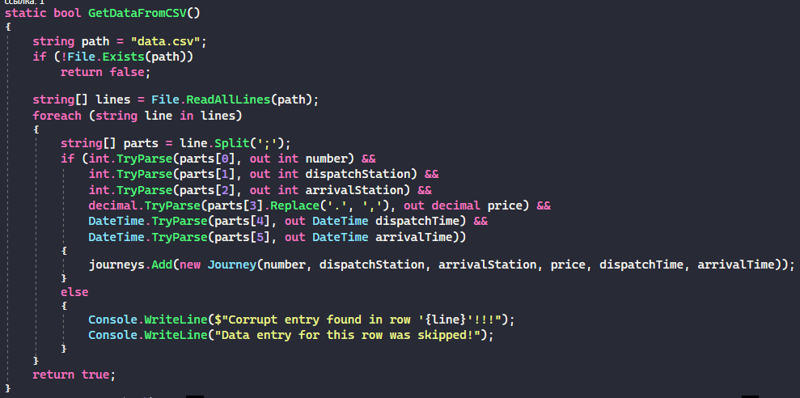
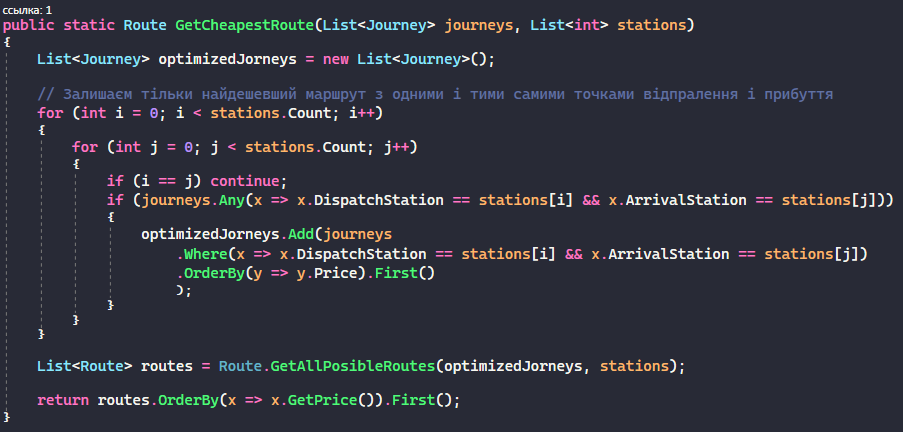

# Тестове завдання від Distributed Lab

## Завдання
Дано расписание переездов поездов между несколькими станциями в формате “номер поезда;станция отправления;станция прибытия;стоимость;время отправления;время прибытия” (гарантированно, что нет переездов дольше суток) . Необходимо получить “лучшие” варианты (несколько, если это возможно) проезда между всеми станциями так чтобы побывать на каждой станции 1 раз. Запросы на лучшие варианты:
- Лучшие по цене
- Лучшие по времени

## Реалізація
Читаєм файл `csv` за допомогою методу `GetDataFromCSV`.

Якщо файл не знайдено, в консолі виводим `CRITICAL ERROR!!! Data file not found.`

Файл `csv` повинен находитись в папці з запускним файлом та називатись `data.csv`

Якщо при спробі читання одного з рядків виникла помилка, цей рядок ігнорується, про що користувача інформує консоль:
```
Corrupt entry found in row '{line}'!!!
Data entry for this row was skipped!
```


Після того як файл був прочитаний, данні зберігаються в списку класів `Journey`

Для того, щоб отримати найкращий маршрут за задани параметром (в даному випадку, по ціні), ми спочатку видаляємо всі маршрути з парами одинакових точок відправлень та прибуття.

Після цього шукаємо всі наявні маршрути  (цей метод підходить лише для невеликої кількості станцій і при невеликому обємі маршрутів, саме для цього ми видаляли лишні маршрути в попередньому пункті).

Знайшовши всі маршрути ми сортуємо їх по заданому параметрі і повертаєо лише перший (тобто найкращий).

